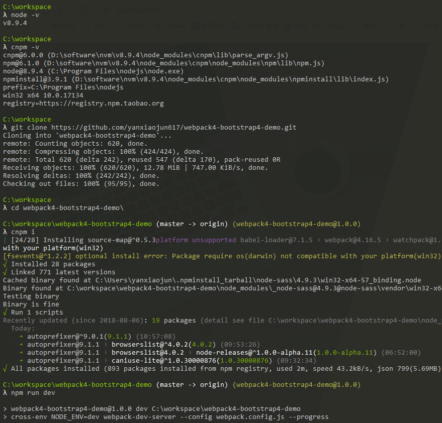

* 本项目集成了bootstrap4，jquery，easyui(可配置)等
* 采用webpack4多页面(多入口)配置，实现常用webpack配置
* [在线demo](https://www.yanxiaojun617.com/webpack4-bootstrap4-demo/)
* [项目源码](https://github.com/yanxiaojun617/webpack4-bootstrap4-demo)
* [项目文档](https://yanxiaojun617.gitbook.io/webpack4-bootstrap4-demo/) 
* 链接——[Bootstrap](https://getbootstrap.com/)、 [jQuery](https://www.jquery123.com/)、[Font Awesome](http://fontawesome.dashgame.com/)、[EasyUi](http://www.jeasyui.com/demo/main/index.php)、[sass/scss](https://www.sass.hk/)， [webpack](https://www.webpackjs.com/configuration/)

# 项目适用于哪些人
* 想使用bootstrap、jquery开发项目，尤其是简单的门户网站，宣传页面等小项目
* 想学习webpack4配置
  > 还不知道webpack是干什么的？
它就是一个打包工具，能帮我们压缩代码，处理图片，热启动（开发时修改代码自动刷新浏览器），代码转义（写[es6](http://es6.ruanyifeng.com/)转成es5，写[scss](https://www.sass.hk/)转成css）等

# 如何运行？
* 确保已安装nodejs，最好是8.x以上，该项目在v8.9.4上测试。
> 如果不会安装nodejs可以参考[这里](https://www.jianshu.com/p/81072e9be3e4),如果想安装多个nodejs版本可以参考[这里](https://www.jianshu.com/p/17d3249e0619),
> 如果本地网络不好可以安装cnpm,详情看[这里](https://www.jianshu.com/p/79d4430e0a9d)
* 检出项目到本地
```
git clone https://github.com/yanxiaojun617/webpack4-bootstrap4-demo.git
```
* 进入项目并安装依赖
```
cd webpack4-bootstrap4-demo
cnpm i
```
* 跑起来
```
npm run dev
```
* 运行步骤参考图


# 打包
```
npm run build
```
> 打包后资源放在dist目录下

* 了解更多请阅读[项目文档](https://yanxiaojun617.gitbook.io/webpack4-bootstrap4-demo/) 
